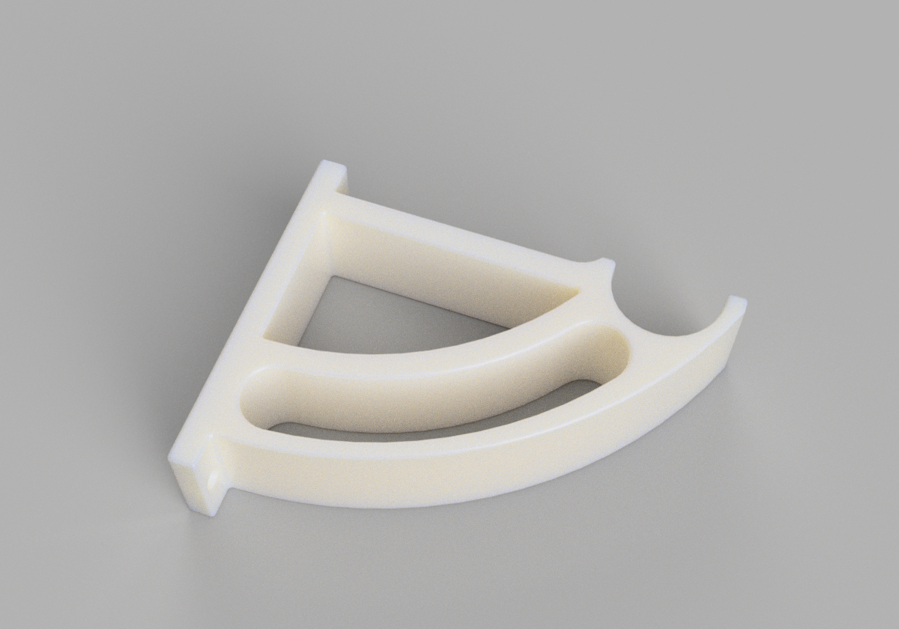

# filament-holder-dowel-bracket
Basic dowel holder bracket for storing 3D printer filament. My first Fusion 360 design.

## Print settings

| Printer brand | Printer     | Rafts | Supports | Resolution | Infill |
| ------------- | ----------- | ----- | -------- | ---------- | ------ |
|   Creality    |  Ender 3 V2 |  No   |  No      | 0.28       |  15%   |
