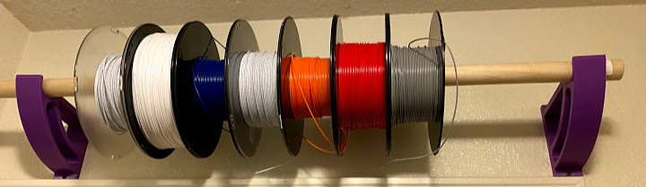
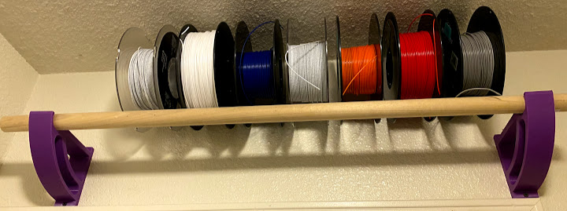

# filament-holder-dowel-bracket
Basic dowel holder bracket for storing 3D printer filament. My first Fusion 360 design.

Filament is held on a 1/2 inch wooden dowel by either placing the dowel through the middle of each spool
or by resting the spools against the dowel and the wall. Brackets are secured by two screws into studs.

## Print settings

| Printer brand | Printer     | Rafts | Supports | Resolution | Infill |  Material |
| ------------- | ----------- | ----- | -------- | ---------- | ------ | --------- |
|   Creality    |  Ender 3 V2 |  No   |  No      | 0.28       |  15%   | PLA       |
